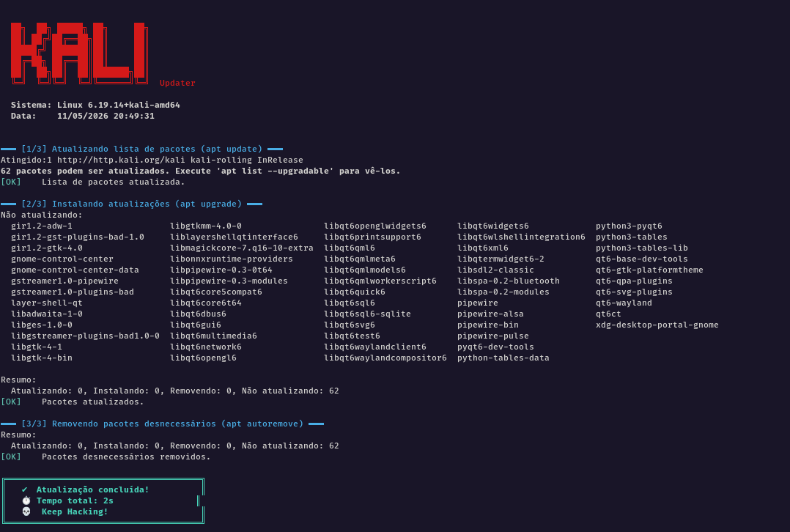

# 🐉 Kali Linux Auto-Updater

Script em Bash para automatizar a atualização d sistema Kali Linux, com saída visual no terminal.

# 📋 Sobre o Projeto

Criei esse script para automatizar o processo de atualização do sistema do kali linux que utilizo no meu dia a dia de forma sequencial em três etapas, e com auxílio da IA pude trazer um aspecto mais visual para o script. 

# ⚙️ O que o script faz

- Atualiza a lista de pacotes disponíveis `apt update`
- Instala as atualizações dos pacotes `apt upgrade`
- Remove pacotes que não são mais necessários `apt autoremove`

# ❗Como executar o script
1. Clone o repositório ou baixe o script:
`git clone https://github.com/seu-usuario/seu-repositorio.git`
cd seu-repositorio
2. Dê permissão de execução:
`chmod +x upgrade.sh`
3. Execute com sudo:
`sudo ./upgrade.sh`

# 🔧 Requisitos

- Sistema operacional: Kali Linux (ou qualquer distro baseada em Debian)
- Shell: Bash
- Permissões: root / sudo
